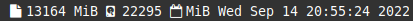

= bar
:toc:

It is my swaybar bar written in C. It can be used in whatever software you want, the only requirement is to support stdout output.

== build and run

Just run make. It will do the stuff.

[source,sh]
----
make
./bar
----

== license

It is link:LICENSE[Unlicense] licensed. Do whatever you want.
